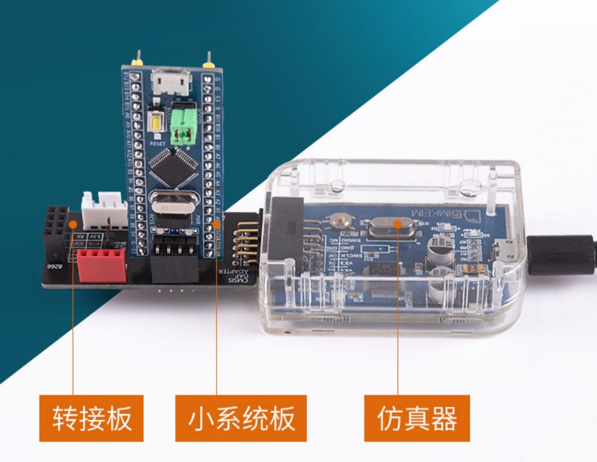

# stm32-demo
## 前置准备
|  项   | 备注  |
|  ----  | ----  |
| 作系统  | macOS 10.14.6 | 
| 编辑器 | Visual Studio Code |
| 目标芯片  | STM32F103C8T6 |
| 仿真器 | CMSIS-DAP |

开始之前请确保你的电脑已经安装了：Rust 和 openocd

## 拉取代码
`git clone git@github.com:pcdeng/stm32-demo.git`

## Visual Studio Code 安装 rust-analyzer
[rust-analyzer Visual Studio Code 插件](https://marketplace.visualstudio.com/items?itemName=rust-lang.rust-analyzer)

## 编译
`cargo build` 
编译出的是 `debug` 模式的，`target/thumbv7m-none-eabi/debug/stm32demo` 就是可以下载到开发板的文件，文件大小比较大。

`cargo build --release`
编译出的是 `release` 模式的。`target/thumbv7m-none-eabi/release/stm32demo` 是可以下载到开发板的文件。文件大小比 `debug` 模式下的小很多。

## 接上调试器


## 开启 openocd 服务
`openocd -f ./openocd.cfg`
成功启动 openocd 服务的话，会出现类似如下信息
```
Open On-Chip Debugger 0.11.0
Licensed under GNU GPL v2
For bug reports, read
        http://openocd.org/doc/doxygen/bugs.html
Info : Listening on port 6666 for tcl connections
Info : Listening on port 4444 for telnet connections
Info : CMSIS-DAP: SWD  Supported
Info : CMSIS-DAP: JTAG Supported
Info : CMSIS-DAP: FW Version = 2.0.0
Info : CMSIS-DAP: Interface Initialised (SWD)
Info : SWCLK/TCK = 1 SWDIO/TMS = 1 TDI = 0 TDO = 1 nTRST = 0 nRESET = 1
Info : CMSIS-DAP: Interface ready
Info : clock speed 1000 kHz
Info : SWD DPIDR 0x1ba01477
Info : stm32f1x.cpu: hardware has 6 breakpoints, 4 watchpoints
Info : starting gdb server for stm32f1x.cpu on 3333
Info : Listening on port 3333 for gdb connections
```
## 登录 telnet 服务
在另一个终端窗口执行 `telnet 127.0.0.1 4444` 
端口 `4444` 是从上一步的日志信息获取的。`Info : Listening on port 4444 for telnet connections`

### 停机
在 telnet 那个终端输入 `halt`

### 写入
`flash write_image erase ./target/thumbv7m-none-eabi/debug/stm32demo`
### 重启
`reset`

# 参考资料
[安装 Rust](https://www.rust-lang.org/zh-CN/tools/install)
[macOS Rust 嵌入式需要安装的软件](https://doc.rust-lang.org/stable/embedded-book/intro/install/macos.html) 我没有安 QEMU 因为我有开发板

[我用的开发板](https://detail.tmall.com/item.htm?_u=3ko4pss5f42&id=631928588828&spm=a1z09.2.0.0.d5592e8dy0qIbk)

[Discovery](https://jzow.github.io/discovery/microbit/index.html)

[stm32f1xx-hal](https://github.com/stm32-rs/stm32f1xx-hal)